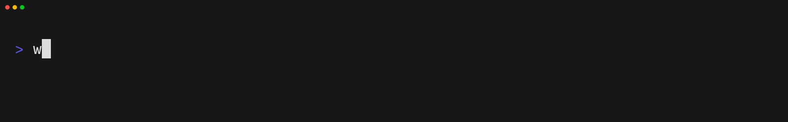

<table>
  <tr>
    <td>
      
       
      
       
      
    </td>
    <td>
      
    </td>
  </tr>
</table>

  
  
  
  
  
  
  
  
  
  
  
  
  
  
  
  
  
  
  
  
  
  
  
  
  
  
  
  
  
  
  
  
  
  
  
  
  
  
  
  
  

---

